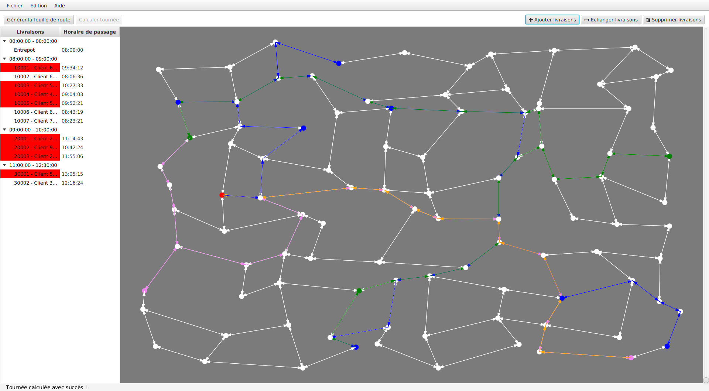

#Devoo : OptimodLyon

## Description
Ce projet est inspiré d'un projet réel piloté par le [Grand Lyon](http://www.grandlyon.com/) entre 2012 et 2015.

Le but de l'application est de fournir un itinéraire (feuille de route) pour une serie de livraisons à partir d'un plan simplifié de la ville. 
Ce calcul est effectué à l'aide de **l'algorithme de Dijkstra** avec des contraintes d'horaires. 

Pour plus de détails, voir le fichier [sujetLivraisons2015.pdf .](https://github.com/Hexabinome/devoo/blob/master/sujetLivraisons2015.pdf)

## Configuration
Il suffit de l'importer dans n'importe quel IDE. Il ne devrait pas avoir de soucis. Le projet requiert **Java 8 et JavaFx8**

## Tests
Les tests sont à placer **obligatoirement** dans ce repertoire `src/test/java`. Maven fournit des plugins par défaut pour faire les tests.
Ceci permet d'automatiser les tests grâce à maven en utilisant ses conventions par défaut.

Pour lancer les tests : `mvn test`.  

## Quelques liens utiles
 - [Tuto JavaFx](http://code.makery.ch/library/javafx-2-tutorial/)
 - [Tuto JUnit](http://blog.soat.fr/2014/02/du-bon-usage-de-junit-12/)

## Contributeurs
 - Alexis Andra
 - Jolan Cornevin
 - Mohamed El Mouctar Haidara 
 - Alexis Papin
 - Robin Royer
 - Maximilan 
 - David Wobrock
